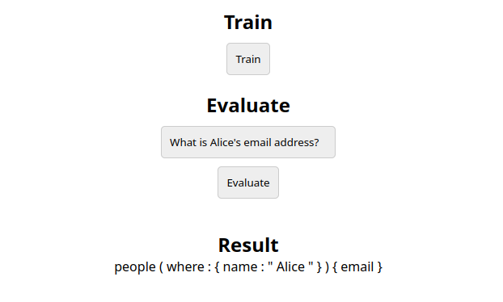

# DataAssistant

DataAssistant is an artificial intelligence library that can generate database queries from natural language prompts, with the help of a specifically trained neural network.

## Why?

The goal of this project is to create a tool that can help users, developers and database administrators to easily query databases without having to learn SQL or other query languages.

This project is still in its early stages, and is not yet ready for production use, but it is already capable of generating queries for simple databases.

## Advantages

-  **Easy to use**: The user only needs to write a natural language prompt, and the library will generate the corresponding query.

-  **Single point of entry**: Using the recommended [Apollo Graphql Server](https://www.apollographql.com/docs/apollo-server/) as a backend, the user can query multiple databases using a single endpoint, without having to migrate data or change the database schema.

-  **Flexibility**: The library can be used with any database, only the training data needs to be changed according to your database schema.

-  **Optional natural language generation[WIP]**: The library can also generate natural language prompts from database queries, which can be useful for generating reports or using the library as a chatbot.

## Example

Included in the repository is a simple example of a GUI that uses the library to query a database, with a neo4j database script and an apollo server setup accordingly.

### Setup

To run the example, you need to have the following installed:
- [Neo4j](https://neo4j.com/download/)
- [Node.js](https://nodejs.org/en/download/)
- [Python](https://www.python.org/downloads/) (if you want to use tensorboard as well).

Run Neo4j, then you need to run the `example/school.cypher` script to create the database schema and insert the example data.

After that, you need to start the apollo server by running the following commands in the `apollo` directory:

```bash
npm install;npm start
```

Then, you need to start the example server by running the following commands:

```bash
cd assistant;npm install;npm run pack;
cd ../example;npm install ../assistant/dist/data-assistant-0.0.1.tgz;npm start
```

On the web ui, you can train the model or evaluate a prompt. You should train the model before evaluating a prompt, otherwise the model will not be able to generate a query.

You can follow the training progress at `localhost:6006` in Tensorboard if it's installed.
Install it with your preferred python package manager.

Start it with the following command in the base directory:

```bash
tensorboard --logdir=logs/tensorboard
```

### UI



## Training Data

The library uses a neural network to generate queries from natural language prompts, and the neural network needs to be trained with a dataset of natural language prompts and their corresponding queries.

You can find the training data used for the example in the `example/training_data.csv` file.

## Roadmap

- [x] Implement a simple neural network that can generate queries from natural language prompts.
- [x] Create a simple example of a GUI that uses the library to query a database.
- [ ] Implement a simple natural language generation model that can create a natural response with the results of a query.
- [ ] Add error tolerance to the prompt parser, so that the user can make mistakes in the prompt and the library can still generate the correct query.
- [ ] Create documentation for the library.